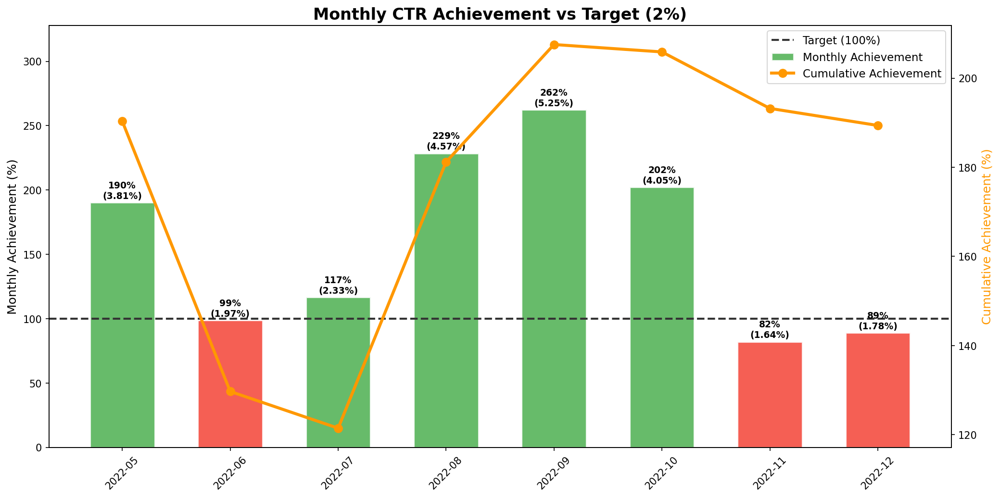
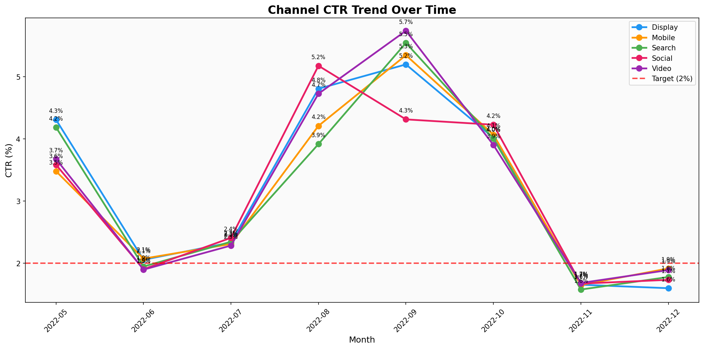
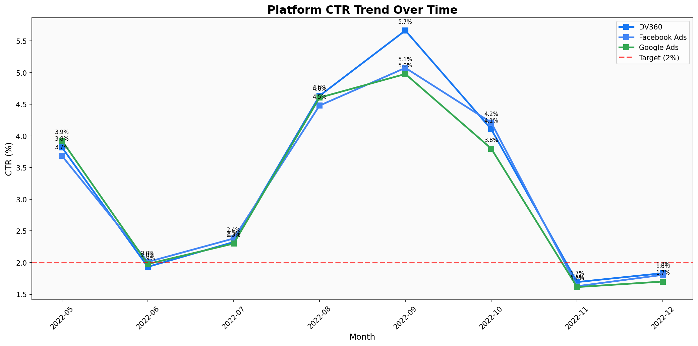
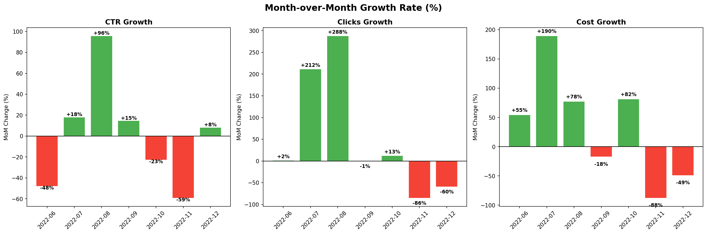
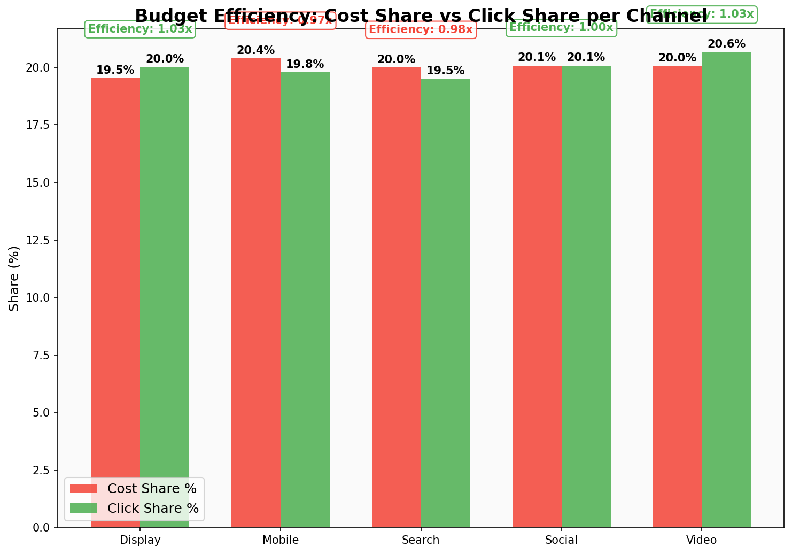
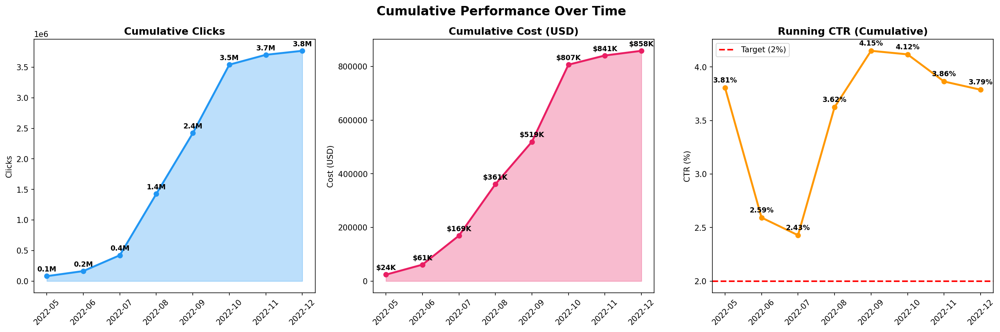

# 📊 Marketing Campaign Performance Analysis & KPI Dashboard

A comprehensive end-to-end data analysis project that evaluates **digital marketing campaign performance** across multiple ad platforms and channels. Built KPIs, pivot tables, scorecards, and an interactive visual dashboard to derive actionable business insights.


---

## 🎯 Project Overview

| Detail | Description |
|--------|-------------|
| **Dataset** | 72,612 records of digital marketing campaigns |
| **Period** | May 2022 – December 2022 |
| **Industry** | E-Commerce (Jewelry Brand) |
| **Platforms** | Facebook Ads, Google Ads, DV360 |
| **Channels** | Display, Mobile, Search, Social, Video |
| **Keywords** | 118 unique targeting keywords |
| **Tools Used** | Python (Pandas, Matplotlib), Excel |

---

## 📁 Project Structure

```
├── Marketing campaign dataset.csv    # Raw dataset (72,612 records)
├── analysis.py                       # Full Python analysis pipeline
├── Campaign_Analysis_Report.xlsx     # Excel report with 8 sheets
├── 01_KPI_Cards.png                  # KPI summary dashboard
├── 02_CTR_per_Channel.png            # CTR comparison by channel
├── 03_Clicks_Cost_per_Channel.png    # Clicks vs Cost by channel
├── 04_CTR_per_Platform.png           # CTR comparison by ad platform
├── 05_Clicks_Over_Time.png           # Daily clicks trend with 7-day MA
├── 06_Cost_Over_Time.png             # Daily cost trend with 7-day MA
├── 07_Top_Keywords.png               # Top 10 keywords by clicks
├── 08_Weekday_vs_Weekend.png         # Weekday vs weekend performance
├── 09_CPC_Comparison.png             # CPC by channel and platform
├── 10_Impressions_Share.png          # Impressions distribution (pie)
├── 11_Efficiency_Matrix.png          # Keyword efficiency scatter plot
├── 12_Achievement_vs_Target.png      # Monthly achievement vs target tracking
├── 13_Channel_CTR_Trend.png          # Channel CTR trend over time
├── 14_Platform_CTR_Trend.png         # Platform CTR trend over time
├── 15_MoM_Growth.png                 # Month-over-month growth waterfall
├── 16_Budget_Efficiency.png          # Cost share vs click share efficiency
├── 17_Cumulative_Performance.png     # Cumulative KPI tracking
└── README.md
```

---

## 🔬 Methodology

### Step 1: Data Understanding
Explored the dataset structure — 35 columns including campaign metadata, performance metrics (impressions, clicks, cost), channel/platform info, temporal data, and keyword targeting.

### Step 2: Data Cleaning
- Validated **zero null values** across all critical columns
- Checked and removed **duplicates** (0 found)
- Ensured all `impressions > 0`
- Identified **9 rows** where `clicks > impressions` and corrected by capping

### Step 3: KPI Creation
Created calculated columns for campaign evaluation:

| KPI | Formula | Result |
|-----|---------|--------|
| **CTR** (Click-Through Rate) | `clicks / impressions` | **3.79%** |
| **CPC** (Cost Per Click) | `cost / clicks` | **$0.23** |
| **CPM** (Cost Per Mille) | `(cost / impressions) × 1000` | **$8.63** |

### Step 4: Pivot Table Analysis
- Performance breakdown by **Channel** and **Ad Platform**
- **Monthly trend** analysis (May–Dec 2022)
- **Top keywords** ranking by clicks and efficiency
- **Weekday vs Weekend** comparison

### Step 5: Scorecard
Benchmarked all channels and platforms against a **2% CTR target** — all channels exceeded the target with 185–194% achievement.

### Step 6: Dashboard & Visualization
Built 17 professional charts covering KPI cards, bar charts, time series, pie charts, and a scatter-based efficiency matrix.

### Step 7: Achievement Trend & Target Tracking
The senior analyst layer — tracking KPI performance over time:
- **Monthly Achievement vs Target** — comparing actual CTR to the 2% target each month, with cumulative tracking
- **Channel & Platform CTR Trends** — how each channel/platform performs month-over-month
- **MoM Growth Analysis** — month-over-month growth rates for CTR, Clicks, and Cost
- **Budget Efficiency** — comparing Cost Share vs Click Share per channel to identify where budget is well-spent vs wasted
- **Cumulative Performance** — running totals showing the big picture trajectory

---

## 📈 Key Performance Indicators


| Metric | Value |
|--------|-------|
| Total Impressions | **99,490,192** |
| Total Clicks | **3,768,319** |
| Total Cost (USD) | **$858,274** |
| Overall CTR | **3.79%** |
| Average CPC | **$0.23** |
| Average CPM | **$8.63** |

---

## 📊 Dashboard Visualizations

### CTR per Channel
> Video channel leads with **3.88% CTR**, all channels exceed the 2% target.


### Clicks & Cost per Channel
> Video delivers the most clicks while maintaining competitive cost levels.


### CTR per Ad Platform
> DV360 outperforms with **3.92% CTR**, followed by Facebook Ads and Google Ads.


### Clicks Over Time
> Major engagement spike in **August–September 2022**, with a secondary peak in October.


### Cost Over Time
> Cost trends follow click patterns, with peak spending aligned to high-engagement periods.


### Top 10 Keywords
> "Drop earrings" leads with **56,811 clicks**, followed by "hair accessories" and "midi rings".


### Weekday vs Weekend
> Weekdays outperform weekends — **3.82% vs 3.62% CTR**.


### Cost Per Click Comparison
> Video and Display offer the lowest CPC at **$0.22**, while Mobile and Search are highest at **$0.23**.


### Impressions Distribution
> Impressions are evenly distributed across channels (~20% each). DV360 leads platforms at **33.9%**.


### Keyword Efficiency Matrix
> Keywords in the **top-left quadrant** (high CTR, low CPC) represent the best opportunities — "retro jewelry", "midi rings", and "statement necklaces" are prime candidates for budget increase.


---

## 📈 Achievement Trend & Target Tracking

### Monthly Achievement vs Target
> **5 out of 8 months** exceeded the 2% CTR target. September peaked at **262% achievement** (5.25% CTR). Q4 shows a clear decline requiring intervention — November dropped to just **82%**.



### Channel CTR Trend Over Time
> All channels follow a similar seasonal pattern, but **Video consistently leads** during peak months. Display and Mobile show the highest consistency — **6/8 months above target**.



### Platform CTR Trend Over Time
> DV360 leads across most months, especially during the Aug–Sep peak where it hits **5.67% CTR**.



### Month-over-Month Growth
> August saw the biggest positive jump (**+96% CTR growth**, **+288% clicks**). November saw the sharpest decline (**-59% CTR**), signaling a need for Q4 campaign strategy revision.



### Budget Efficiency: Cost Share vs Click Share
> **Video** and **Display** have efficiency ratios above 1.0x — generating **more clicks than their share of budget**. Mobile (0.97x) and Search (0.98x) are slightly underperforming relative to their cost.



### Cumulative Performance Over Time
> Running CTR stabilizes at **3.79%** by end of period, with cumulative achievement at **189%** of target. Total spend reached **$858K** producing **3.77M clicks**.



---

## 🏆 Scorecard

### Channel Performance vs Target (2% CTR)

| Channel | Actual CTR | Target | Achievement | Status |
|---------|-----------|--------|-------------|--------|
| Video | 3.88% | 2.00% | 194% | ✅ On Target |
| Display | 3.85% | 2.00% | 192% | ✅ On Target |
| Social | 3.79% | 2.00% | 189% | ✅ On Target |
| Mobile | 3.72% | 2.00% | 186% | ✅ On Target |
| Search | 3.70% | 2.00% | 185% | ✅ On Target |

### Platform Performance vs Target

| Platform | Actual CTR | Target | Achievement | Status |
|----------|-----------|--------|-------------|--------|
| DV360 | 3.92% | 2.00% | 196% | ✅ On Target |
| Facebook Ads | 3.79% | 2.00% | 189% | ✅ On Target |
| Google Ads | 3.65% | 2.00% | 182% | ✅ On Target |

---

## 💡 Key Insights & Recommendations

### Findings
1. **Video is the top-performing channel** — highest CTR (3.88%) and lowest CPC ($0.22), delivering the best ROI
2. **DV360 outperforms Facebook Ads and Google Ads** in engagement rate (3.92% vs 3.79% vs 3.65%)
3. **Weekdays drive stronger engagement** — 5.5% higher CTR than weekends
4. **High-efficiency keywords identified** — "statement necklaces" (5.70% CTR, $0.14 CPC), "nature-inspired jewelry" (5.29% CTR, $0.14 CPC)
5. **September was peak month** — CTR spiked to 5.25% (262% achievement), suggesting seasonal opportunity
6. **November–December showed decline** — CTR dropped to ~1.7% (82% achievement), with November showing a -59% MoM decline
7. **Video & Display have the best budget efficiency** — Efficiency Ratio > 1.0x, meaning they generate more clicks than their share of budget
8. **Cumulative achievement reached 189%** — the overall campaign exceeded targets despite Q4 weakness

### Recommendations
- **Increase Video channel budget allocation** to capitalize on superior CTR and lower CPC (Efficiency Ratio: 1.03x)
- **Scale high-efficiency keywords** (top-left quadrant in efficiency matrix) for maximum ROI
- **Shift 5-10% budget from Mobile/Search to Video/Display** — Mobile (0.97x) underperforms relative to budget share
- **Leverage DV360** as primary ad platform given its consistent performance edge
- **Boost weekend campaigns** with targeted content to close the weekday-weekend CTR gap
- **Plan seasonal campaigns** around August–September engagement peaks
- **Investigate Q4 decline** — November's -59% MoM CTR crash signals a campaign or audience fatigue issue
- **Set up monthly achievement dashboards** to track target vs actual in real-time and catch declines early

---

## 🛠️ How to Run

```bash
# Prerequisites
pip install pandas matplotlib openpyxl xlsxwriter

# Run the analysis
python analysis.py
```

This generates:
- `Campaign_Analysis_Report.xlsx` — Full Excel report with 11 analysis sheets
- 17 PNG dashboard charts

---

## 📬 Contact

Feel free to reach out for questions or collaboration opportunities.

---

> *"I analyzed 72,612 campaign records across 3 ad platforms and 5 channels. I identified that Video delivers the highest engagement (CTR: 3.88%) with the most cost-effective clicks at $0.22 CPC. This analysis enables data-driven budget allocation to maximize ROI across channels."*
